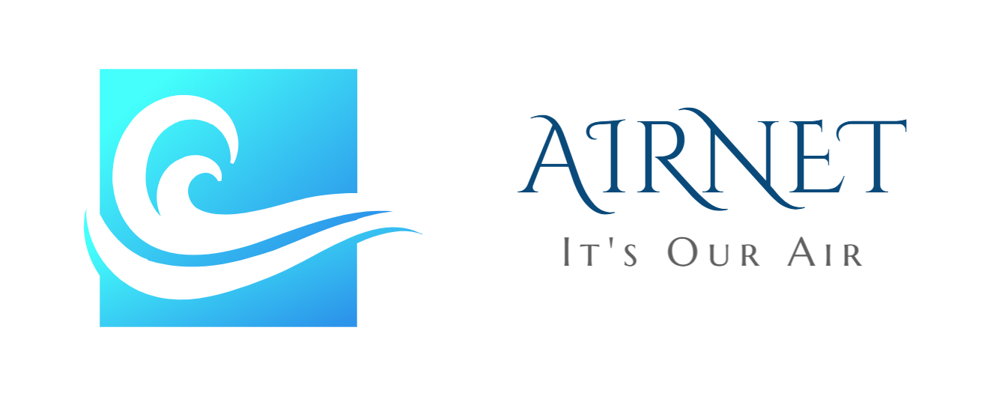
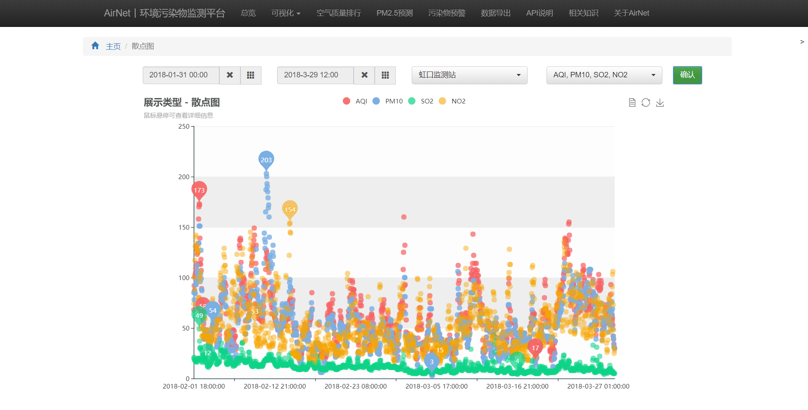
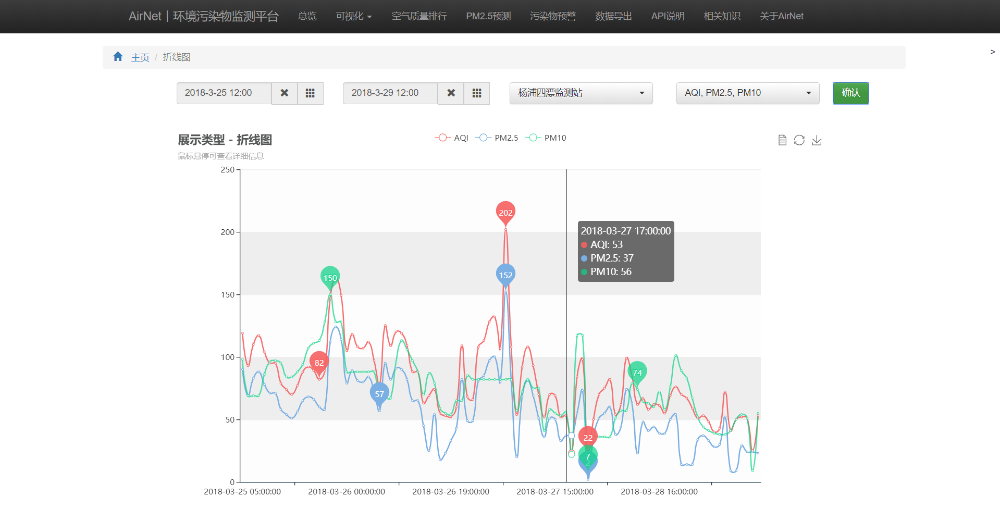
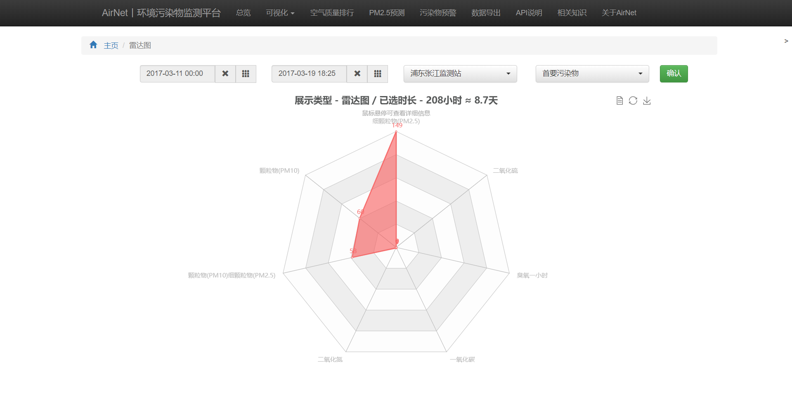
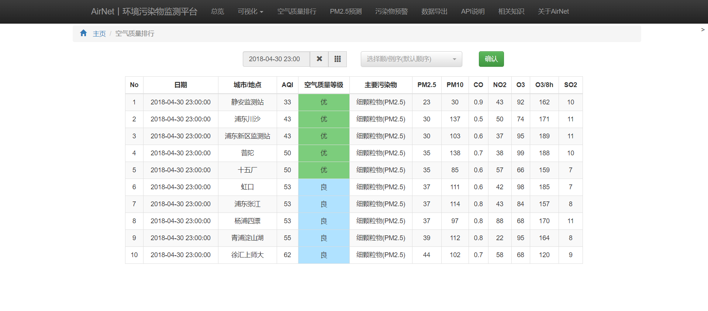
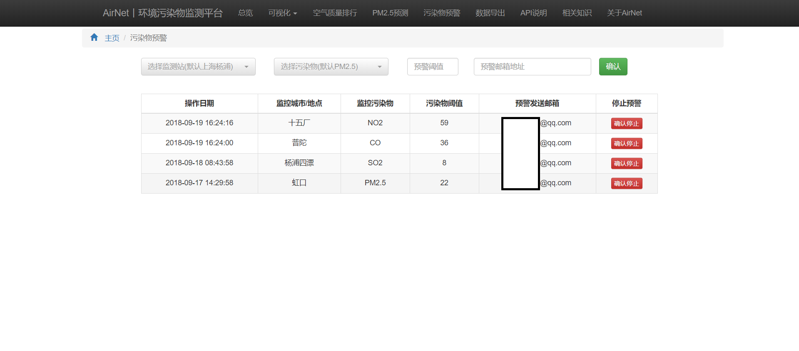
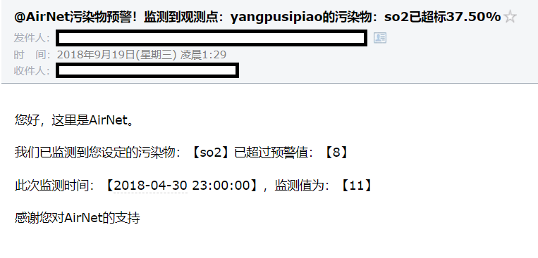

# AirNet
[](https://opensource.org/licenses/mit-license.php)

[](https://github.com/Marticles/AirNet/blob/master/README_zh.md)

# What is AirNet?

AirNet is a data platform for real-time monitoring, visualization, early alert and forecasting of air pollution.

We provides seven types of interactive charts. By building LSTM(Long Short-Term Memory) model based on seq2seq(sequence to sequence) architecture, we achieve short-term, medium term and long-term forecasting, from one day to one year.

By using 'Air Pollution Alert' module, if the lastest air pollution over the limits you setted before, it will send a email to alert you.

You can use API to get the history data, forecasting data and the lasetest data, or just directly export data to csv file.


# To-do List
* [ ] Crawler
* [x] Visualization
* [x] Air Quality Rank
* [x] PM2.5 Forecasting
* [x] Air Pollution Alert
* [x] Data Export
* [x] API

# About API

The API returns data include the following.

|Field|Content|
|-|-|
|request_site|User Request Site|
|data|Return Data|
|time|Air Pollution Monitor Time|
|city|Monitoring Site’s City|
|site|Monitoring Site|
|aqi|Air Quality Index(AQI)|
|level|The level of Air Quality Index|
|pm25|Hourly Average of PM2.5|
|pm10|Hourly Average of PM10|
|co|Hourly Average of CO|
|no2|Hourly Average of NO2|
|ozone1hour|Hourly Average of Ozone|
|ozone8hour|Eight Hours Average of Ozone|
|so2|Hourly Average of SO2|

The meaning of URL and parameters are as follows.

|URL/Parameters|Content|
|-|-|
|site|Monitoring Site, e.g. `jingan`,`hongkouu`|
|pollution|Air Pollution, e.g.`so2`,`pm25`, when this value equals`all`, API will return the whole data|
|start|Start Time, e.g. `2018-01-01 01:00:00`, because the data source is updated once hourly, the part of minutes will be ignored|
|end|End Time, e.g. `2018-01-01 01:00:00`, because the data source is updated once hourly, the part of minutes will be ignored|

## 1. Request History Data
### 1.1 URL
```
api/history/site/pollution?start=start_time&end=end_time
```

### 1.2 Example
#### 1.2.1 Request URL
```
api/history/jingan/so2?start=2018-02-10 10:00&end=2018-02-23 20:00
```
#### 1.2.2 Return Json
```
{
    "request_site": "jingan",
    "data": [
        {
            "time": "2018-02-10 10:00:00",
            "so2": "15"
        },
        {
            "time": "2018-02-10 11:00:00",
            "so2": "22"
        },
		...
        {
            "time": "2018-02-23 20:00:00",
            "so2": "11"
        }
    ]
}
```

## 2. Request The Lastest Data
### 2.1 URL
```
api/lastest/site/pollution
```

### 2.2 Example
#### 2.2.1 Request URL
```
api/lastest/yangpusipiao/all
```
#### 2.2.2 Return Json
```
{
    "request_site": "yangpusipiao",
    "data": [
        {
            "time": "2018-04-30 23:00:00",
            "city": "上海",
            "site": "杨浦四漂",
            "aqi": 53,
            "level": "良",
            "primarypollutant": "细颗粒物(PM2.5)",
            "pm25": "37",
            "pm10": "97",
            "co": "0.8",
            "no2": "88",
            "ozone1hour": "68",
            "ozone8hour": "170",
            "so2": "11"
        }
    ]
}
```

## 3. Request Forecast Data
### 3.1 URL
```
api/forecast/site?start=start_time&end=end_time
```

### 3.2 Example
#### 3.2.1 Request URL
```
api/forecast/jingan?start=2018-05-10 10:00&end=2018-05-23 20:00
```
#### 3.2.2 Return Json
```
{
    "request_site": "jingan",
    "data": [
        {
            "time": "2018-05-10 10:00:00",
            "so2": "40.526"
        },
        {
            "time": "2018-02-10 11:00:00",
            "so2": "36.15"
        },
		...
        {
            "time": "2018-05-23 20:00:00",
            "so2": "52.201"
        }
    ]
}
```


# Screenshots
## Home Page

## Part of Charts



## Air Quality Rank

## PM2.5 Forecasting

## Air Pollution Alert


## Data Export


