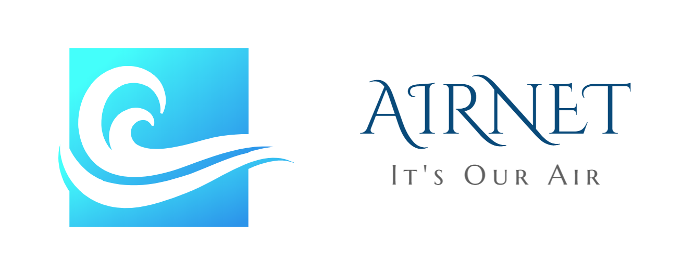
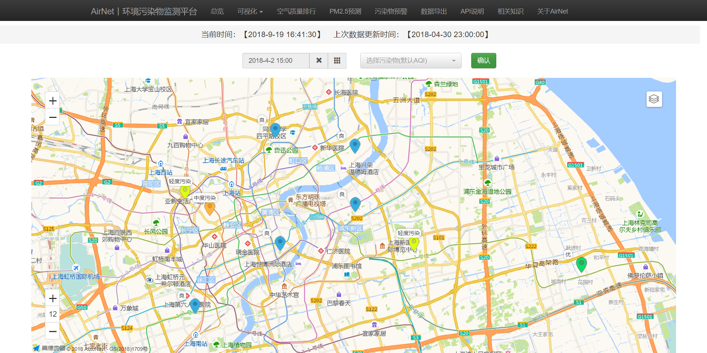
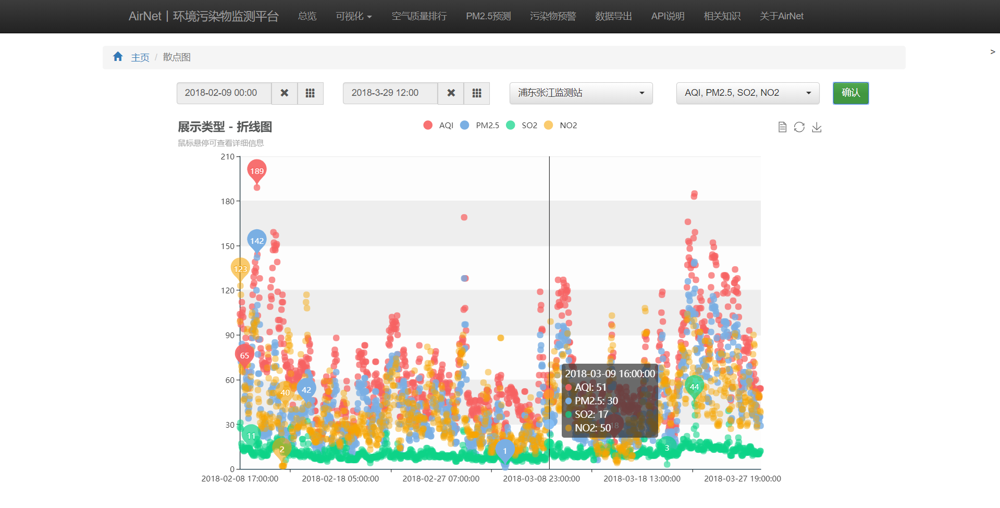
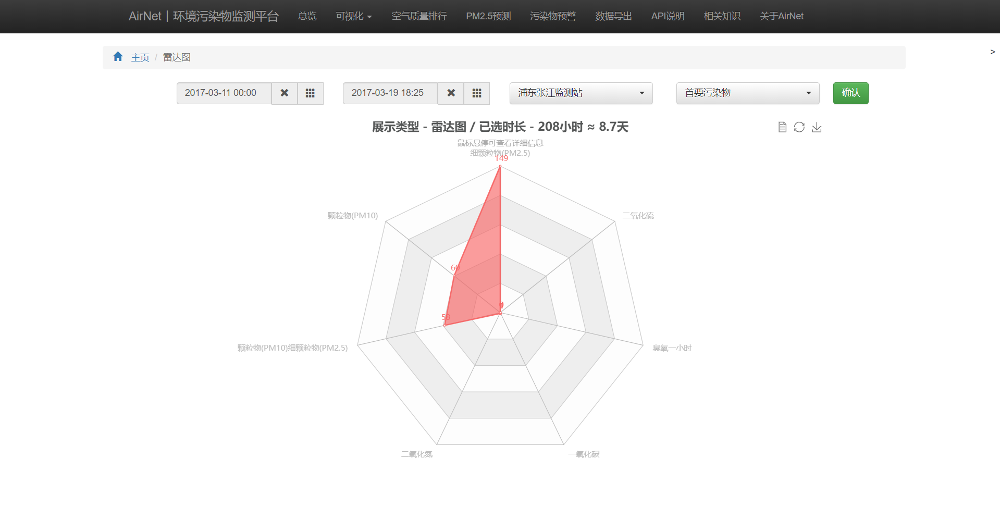
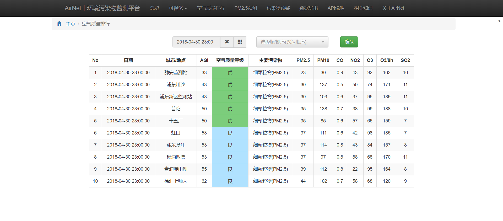
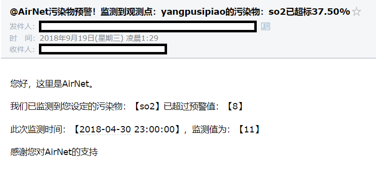
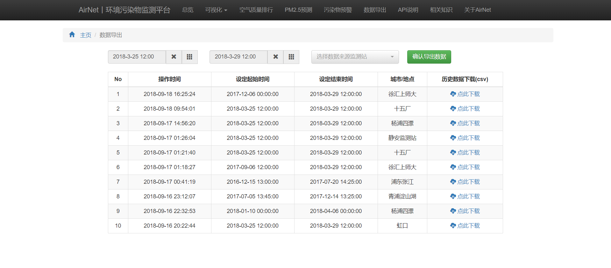

# AirNet
[](https://opensource.org/licenses/mit-license.php)

[](https://github.com/Marticles/AirNet/blob/master/README.md)


# 关于AirNet
AirNet是一个提供环境污染物实时监测、预警、预测的数据平台，基于Flask与Tensorflow开发。

# 功能
* [x] 实时爬虫
* [x] 可视化：提供基于地理位置的监测点污染物展示与7种污染物数据图表展示
* [x] 空气质量排行：支持实时与历史排行
* [ ] PM2.5预测：基于seq2seq架构，encoder与decoder都是lstm，提供时间跨度长达一年的未来PM2.5预测
* [x] 污染物预警：设定监测点、监测污染物、预警阈值后当污染物超过阈值时，系统将自动发送预警邮件至设定邮箱内
* [x] 数据导出：提供历史数据导出，导出文件格式为csv
* [x] API：用户可通过调用API获得污染物历史数据、最新数据与PM2.5预测数据

# API说明
API返回的数据包括了以下内容：

|字段|内容|
|-|-|
|request_site|用户请求监测点|
|data|返回数据|
|time|污染物监测时间|
|city|监测点所属城市|
|site|监测点|
|aqi|空气质量指数(AQI)，即air quality index，是定量描述空气质量状况的无纲量指数|
|level|空气质量指数类别，有“优、良、轻度污染、中度污染、重度污染、严重污染”6类|
|primarypollutan|首要污染物|
|pm25|颗粒物（粒径小于等于2.5μm）1小时平均|
|pm10|颗粒物（粒径小于等于10μm）1小时平均|
|co|一氧化碳1小时平均|
|no2|二氧化氮1小时平均|
|ozone1hour|臭氧1小时平均|
|ozone8hour|臭氧8小时平均|
|so2|二氧化硫1小时平均|

URL及参数含义如下：

|URL/参数|含义|
|-|-|
|site|监测点，为英文代码，如`jingan`、`hongkouu`|
|pollution|污染物，如`so2`、`pm25`，当为`all`时将返回全部污染物数据|
|start|开始时间，如`2018-01-01 01:00:00`，由于数据源每小时更新一次，输入的分钟部分将被忽略|
|end|结束时间，如`2018-01-01 01:00:00`，由于数据源每小时更新一次，输入的分钟部分将被忽略|

## 1. 请求历史数据
### 1.1 URL
```
api/history/site/pollution?start=start_time&end=end_time
```
参数含义请参照上述说明

### 1.2 示例
#### 1.2.1 请求URL
```
api/history/jingan/so2?start=2018-02-10 10:00&end=2018-02-23 20:00
```
#### 1.2.2 返回Json
```
{
    "request_site": "jingan",
    "data": [
        {
            "time": "2018-02-10 10:00:00",
            "so2": "15"
        },
        {
            "time": "2018-02-10 11:00:00",
            "so2": "22"
        },
		...
        {
            "time": "2018-02-23 20:00:00",
            "so2": "11"
        }
    ]
}
```

## 2. 请求最新数据
### 2.1 URL
```
api/lastest/site/pollution
```
参数含义请参照上述说明

### 2.2 示例
#### 2.2.1 请求URL
```
api/lastest/yangpusipiao/all
```
#### 2.2.2 返回Json
```
{
    "request_site": "yangpusipiao",
    "data": [
        {
            "time": "2018-04-30 23:00:00",
            "city": "上海",
            "site": "杨浦四漂",
            "aqi": 53,
            "level": "良",
            "primarypollutant": "细颗粒物(PM2.5)",
            "pm25": "37",
            "pm10": "97",
            "co": "0.8",
            "no2": "88",
            "ozone1hour": "68",
            "ozone8hour": "170",
            "so2": "11"
        }
    ]
}
```


# 截图
## 主页

## 部分图表



## 空气质量排行

## 污染物预警


## 数据导出



